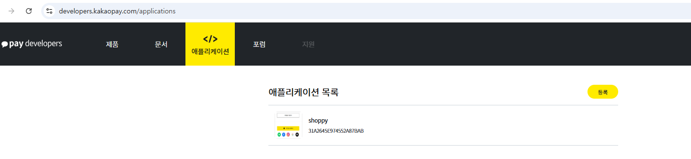
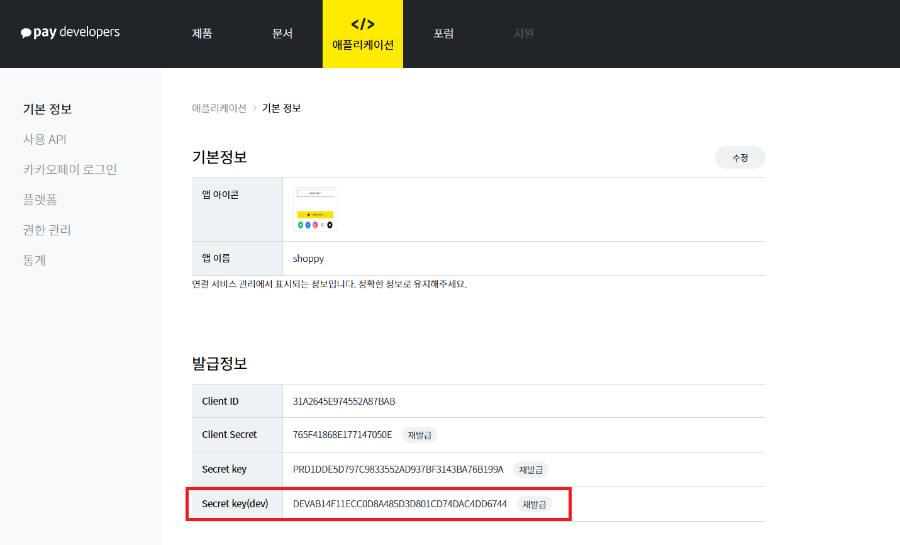
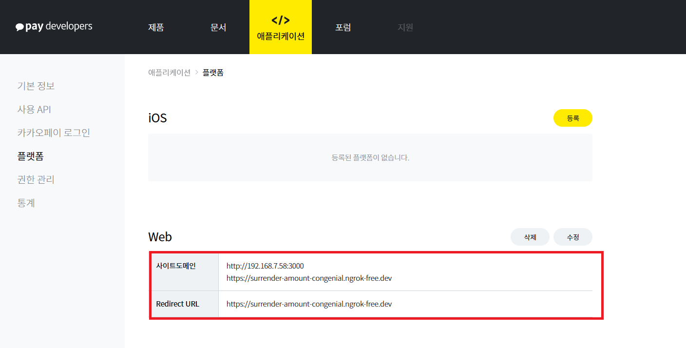
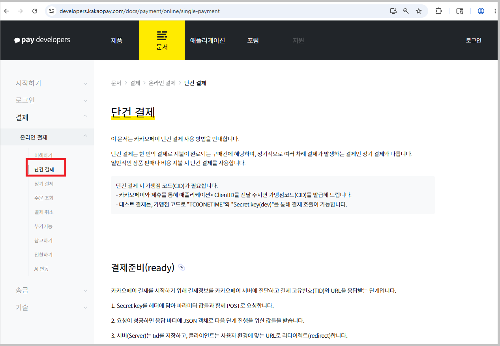
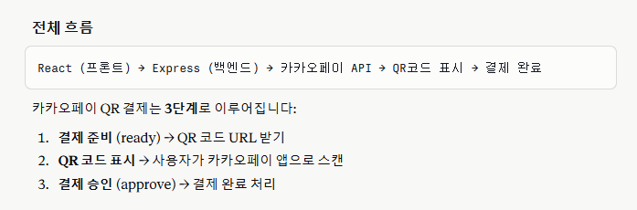
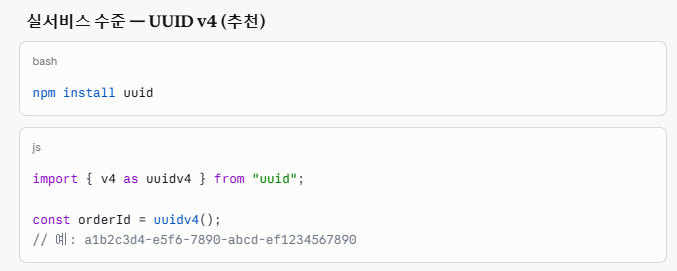
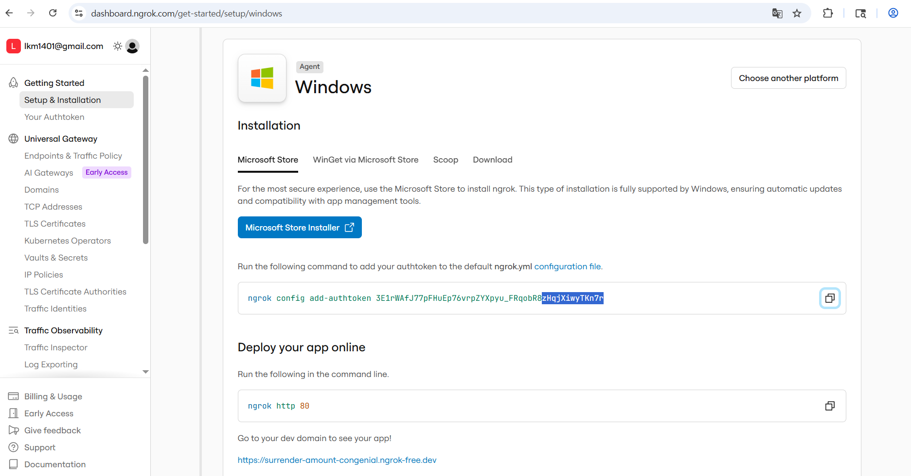
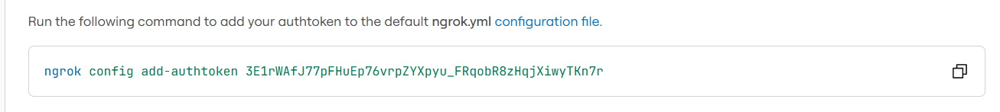
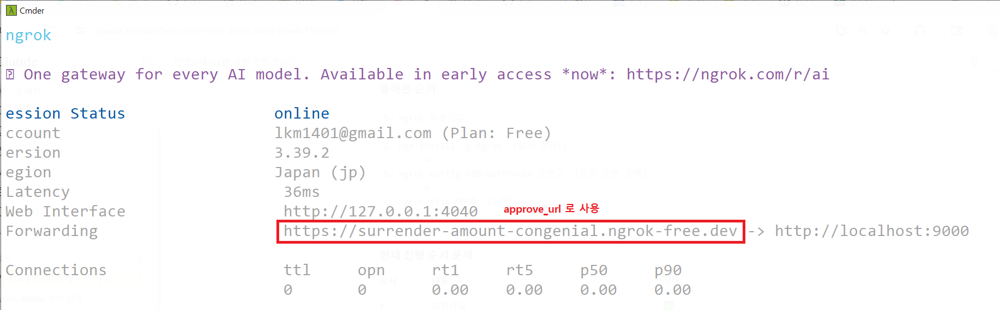
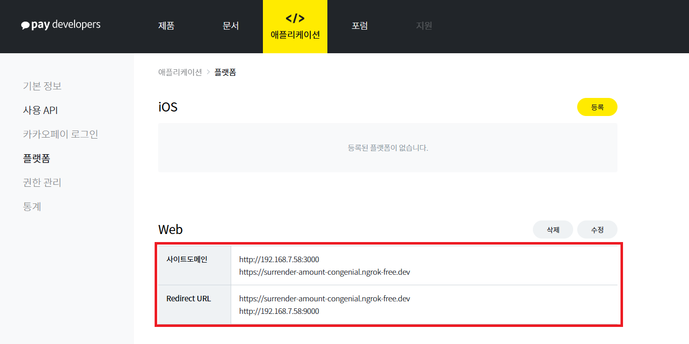

# 카카오페이 QR 결제 진행 순서

## 1️⃣ 실습 파일 공유

- github 공유 주소 : https://github.com/tjg-data/shoppy

- 🎯 .env 파일은 .gitignore 파일에서 필터링 되므로 실행 전 준비 필요!!

```
# SERVER_PORT
SERVER_PORT=9000

# DB
DB_HOST=localhost
DB_USER=root
DB_PASSWORD=mysql1234
DB_NAME=shoppy
DB_PORT=3306

```

<br>

## 2️⃣ 카카오 인증키 발급 - 카카오페이 개발자 센터

- ✨카카오페이 개발자센터에서만 발급된 인증키 사용 가능



- Secret key(dev) 발급해야함!



- 최종 ngrok를 사용하여 등록해야함!!




<br>

## 3️⃣ 카카오페이 REST API 가이드 확인

- 카카오페이 개발자 센터 REST API 사이트 : https://developers.kakaopay.com/docs/payment/online/single-payment




<br>

## 4️⃣ 카카오페이 QR 결제




### ✅ 프론트 코드

- 프론트 패키지 설치 : 주문번호 생성(orderId) 시 UUID, QR 띄우기

```
npm install uuid
npm install qrcode.react

```


### (1) components/commons/QRModal.jsx 생성 및 공유

```
import { useState } from "react";
import { QRCodeSVG } from "qrcode.react";
import axios from "axios";

export default function QRModal({ qrUrl, amount, onClose }) {
  return (
    <div style={{
      position: "fixed", inset: 0,
      background: "rgba(0,0,0,0.45)",
      display: "flex", alignItems: "center", justifyContent: "center",
      zIndex: 1000
    }}>
      <div style={{
        background: "#fff", borderRadius: "16px",
        padding: "2rem", width: "320px", textAlign: "center"
      }}>
        {/* 헤더 */}
        <div style={{ display:"flex", justifyContent:"space-between", alignItems:"center", marginBottom:"1.5rem" }}>
          <span style={{ fontSize:"16px", fontWeight:500 }}>카카오페이 QR 결제</span>
          <button onClick={onClose} style={{ background:"none", border:"none", cursor:"pointer", fontSize:"20px" }}>✕</button>
        </div>

        {/* 카카오 배지 */}
        <div style={{ background:"#FEE500", borderRadius:"8px", padding:"0.75rem", marginBottom:"1.5rem" }}>
          <span style={{ fontWeight:500, color:"#3C1E1E" }}>💛 카카오페이로 결제</span>
        </div>

        {/* QR 코드 */}
        <div style={{ background:"#f9f9f9", borderRadius:"8px", padding:"1.5rem", marginBottom:"1rem" }}>
          <QRCodeSVG value={qrUrl} size={160} />
        </div>

        <p style={{ fontSize:"13px", color:"#888", margin:"0 0 0.5rem" }}>
          핸드폰 카카오페이 앱으로 QR을 스캔하세요
        </p>
        <p style={{ fontSize:"12px", color:"#aaa", margin:0 }}>
          결제금액: <strong style={{ color:"#222" }}>{amount.toLocaleString()}원</strong>
        </p>
      </div>
    </div>
  );
}

```
<br>

### (2) pages/Checkout.jsx

- 카카오페이 QR 결제 데이터 준비
- orderId(랜덤생성, uuidv4 사용), userId, itemName, quantity, totalAmount




```
 import QRModal from "../../components/commons/QRModal.jsx";


  const cartList = useAuthStore((s) => s.cartList);
  const userId = useAuthStore((s) => s.userId);
  const quantity = useAuthStore((s) => s.cartCount);
  const [qrUrl, setQrUrl] = useState(null);  
  const [showModal, setShowModal] = useState(false);

  const handlePayment = async() => {
    if (!terms || !privacy) {
      alert('필수 약관에 모두 동의해야 결제가 가능합니다.');
      return;
    }
    // alert('결제 기능은 준비 중입니다.');
    // 카카오페이 QR 결제 진행
    // orderId(랜덤생성, uuidv4 사용), userId, itemName, quantity, totalAmount 준비
    const orderId = uuidv4();
    const itemName = cartList[0].name + '등..';
    const totalAmount = totalPrice;
    const data = { orderId, userId, itemName, quantity, totalAmount };

    // console.log(orderId, userId, itemName, quantity, totalAmount );
    // console.log('data :: ', data);
    const result = await axiosPost('/kakao/ready', data);
    const { tid, next_redirect_mobile_url } = result;

    //next_redirect_mobile_url 주소를 인코딩하여 QR 출력, const [qrUrl, setQrUrl] = useState(null);
    //npm install qrcode.react QR 인코딩을 위해 패키지 설치
    if(tid) {
      setQrUrl(next_redirect_mobile_url);
      setShowModal(true);

      // 네트웍환경 이슈로(사설IP) 15초 후 모달 닫기
      setTimeout(() => {
          setShowModal(false);
      }, 15000);
    }
  };


  return (
      ...

      {/* 카카오페이 결제 시 QR 코드 표시 */}
      {showModal && qrUrl && (
        <QRModal
          qrUrl={qrUrl}
          amount={totalPrice}
          onClose={() => setShowModal(false)}
        />
      )}
  )


```

<br>

### ✅ 서버 추가 코드

### (1) .env 파일에 KAKAO KEY 추가

```
# SERVER_PORT
SERVER_PORT=9000

# DB
DB_HOST=localhost
DB_USER=root
DB_PASSWORD=mysql1234
DB_NAME=shoppy
DB_PORT=3306

# KAKAO KEY
KAKAO_SECRET_KEY=DEVAB14F11ECC0D8A485D3D801CD74DAC4DD6744

```

### (2) app.js

```
import kakaoRouter from './routes/kakao.js';

...

app.use('/kakao', kakaoRouter);

```

### (3) routes/kakao.js

```
import express from 'express';
import * as controller from '../controller/kakao.js';

const router = express.Router();

router.post('/ready', controller.getReady);
router.get('/approve', controller.getApprove); //QR 스캔 결제를 위해 서버로 redirection 반드시 GET!!


export default router;

```

### (4) controller/kakao.js

```
import axios from 'axios';
import dotenv from 'dotenv';
dotenv.config();

let approvalData = {}; // pg_token 임시 저장 (실제 서비스에서는 DB 사용)

/**
 * 1단계 결제 준비 -> QR 주소 반환
 */
export const getReady = async(req, res, next) => {
    const { orderId, userId, itemName, quantity, totalAmount } = req.body;

    try {
        //1. 카카오페이 서버에 요청
        //cid - 무료 계정인 경우 'TC0ONETIME', 실제는 가맹점 번호 
        const readyURL = `https://open-api.kakaopay.com/online/v1/payment/ready`;
        const data = {
            "cid": "TC0ONETIME",
            "partner_order_id": orderId,
            "partner_user_id": userId,
            "item_name": itemName,
            "quantity": quantity,
            "total_amount": totalAmount,
            // "vat_amount": "200",
            "tax_free_amount": 0,  // 필수
            //"approval_url": "http://192.168.7.58:9000/success",///실제 서비스에서는 https만 가능!!
            "approval_url": `https://surrender-amount-congenial.ngrok-free.dev/kakao/approve?partner_order_id=${orderId}`,
            "fail_url": "http://192.168.7.58:3000/fail",
            "cancel_url": "http://192.168.7.58:3000/cancel"
        };
        const header = {
            headers: {
                "Authorization": `SECRET_KEY ${process.env.KAKAO_SECRET_KEY}`,
                "Content-Type": "application/json",
            },
        }
// console.log(readyURL, data, header);
// console.log('키 확인 :: ', process.env.KAKAO_SECRET_KEY);
// console.log('키 길이 :: ', process.env.KAKAO_SECRET_KEY?.length); // 반드시 40이어야 함

        const readyResponse = await axios.post(readyURL, data, header);
        const {tid, next_redirect_mobile_url } = readyResponse.data;
        // console.log('ready 결과 :: ', readyResponse.data);
        // next_redirect_mobile_url

        // tid와 주문 정보 임시 저장 (pg_token 검증용)
        approvalData[orderId] = {
            tid,
            orderId,
            userId,
        };


        res.json({
            tid,
            next_redirect_mobile_url 
        });

    } catch (error) {
            console.error('에러 상태코드 :: ', error.response?.status);
            console.error('에러 메시지 :: ', error.response?.data);
    }
}


/**
 * 2단계 결제 진행 -> QR 주소 반환QR 스캔 후 카카오에서 서버로 리다이렉션하여 결제 진행
 */
export const getApprove = async(req, res, next) => {
    console.log('req.query--> ', req.query);
    const { pg_token, partner_order_id } = req.query;
    const saved = approvalData[partner_order_id];

    if (!saved) return res.status(400).send("주문 정보 없음");

    try {
        const approveURL = `https://open-api.kakaopay.com/online/v1/payment/approve`;
        const data = {
            cid: "TC0ONETIME",
            tid: saved.tid,
            partner_order_id: saved.orderId,
            partner_user_id: saved.userId,
            pg_token,
        }
        const header = {
            headers: {
            Authorization: `SECRET_KEY ${process.env.KAKAO_SECRET_KEY}`,
            "Content-Type": "application/json",
            },
        }

        const approveResponse = await axios.post(approveURL, data, header);
console.log('approveResponse -->> ', approveResponse);

        // 결제 완료 → React 앱으로 리다이렉트
        // 사설IP이므로 카카오페이 서버에서 찾지 못함!
        // ngrok 패키지는 무료로 1개 터널만 연결됨!!
        // 우선 approveResponse.status 값이 200이면 카카오 결제 성공
        // 강제로 페이지 이동
        if(approveResponse.status === 200) {
            delete approvalData[partner_order_id]; // 사용 후 삭제
            res.json({"isPayment": 1})
        }

        // 결제 완료 → React 앱으로 리다이렉트
        // 사설IP이므로 카카오페이 서버에서 찾지 못함!
        // ngrok 패키지는 무료로 1개 터널만 연결됨!!
        // res.redirect(`http://192.168.7.58:3000/success?item=${approveResponse.data.item_name}&amount=${approveResponse.data.amount.total}`);
    } catch (err) {
        console.error(err.response?.data || err.message);
        res.redirect("http://192.168.7.58:3000/fail");
    }
}


```
<br>

## 5️⃣ ngrok 패키지 사용법

- 💥사설IP 사용으로 PC와 QR 결제가 연동되지 않아, ngrok 패키지를 설치하여 사용, 공인 IP에서는 문제 없음. 배포후 사용하는 것은 문제 없음
- ngrok 패키지 설치 : 터미널 어디에서든 사용 가능

### (1) ngrok 회원가입




### (2) ngrok 설치 - 터미널 어디에서든 상관없음!

```
npm install -g ngrok

```

### (3) ngrok 인증 토큰 등록



```
ngrok config add-authtoken 3E1rWAfJ77pFHuEp76vrpZYXpyu_FRqobR8zHqjXiwyTKn7r

```

### (4) ngrok http 9000  명령 실행

```
ngrok http 9000

```




## 6️⃣ 카카오페이 개발자 센터 플랫폼 수정

- ngrok 게이트웨이를 이용하여 연동한 주소를 카카오페이 개발자 센터 플랫폼에 등록 한다.


